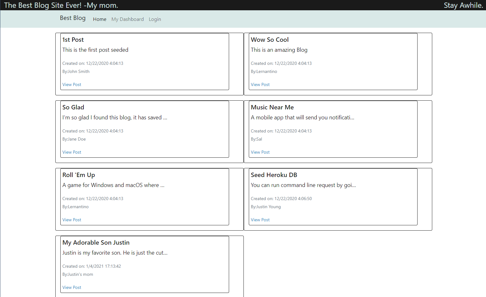

# JY Blog MVC

## Description
This project uses a full stack of NodeJS, Express, Handlebars, Heroku, MySQL, sessions, dotenv, bcrypt to create a blog-like website
## Table of Contents
* [`Project`](#)
* [`Description`](#Description)
* [`Table of Contents`](#Table-of-Contents)
* [`1nstallation Steps`](#Installation-Steps)
* [`Usage Information`](#Usage-Information)
* [`Testing`](#Testing)
* [`License`](#License)
* [`Contributing`](#Contributing)
* [`Questions`](#Questions)
* [`Sample`](#Sample)
## Installation Steps
To install this project, do the following:
> 1. To Install on LocalHost:   Clone repository to local workspace
> 2. Open terminal in project base directory and run "npm install"
> 3. Copy contents of db/db-init.sql to your local MySQL workbench and run to create db.
> 4. Edit .env.EXAMPLE file to have your local environment values
> 5. Rename .env.EXAMPLE to .env
> 6. In terminal run "npm run seed" to create initial db entries
> 7. In terminal run "npm run start" to launch application

## Usage Information
To use this project, do the following:
> 1. Ensure Installation Steps have been completed.
> 2. For localhost:   Open Browser and browse to URL https://localhost:3001
> 3. You may view posts, login, create post, comment on posts, delete posts.

## Testing
To test this project, do the following:
> 1. To test on Heroku, Ensure Installation steps are complete
> 2. Verify Working on localhost, by performing Usage Steps
> 3. Push your local project to heroku, in terminal run commmand "heroku login"
> 4. Login to your Heroku account in the browser window that pops up, then return to terminal.
> 5. Run command "heroku create my_blog_site", to create a heroku app from project
> 6. Verify connection between github and heroku by running command "git remote -v"
> 7. Push code to heroku by running "git push heroku main"
> 8. Login to your Heroku account in web browser and find the app just published.
> 9. In the menu bar select "more->Run console"
> 10. In the console that comes up run "npm run seed", to create initial entries in heroku db.
> 11. Select "settings" under your app in heroku browser and scroll down to "Domain" area.
> 12. This is where it lists the domain to your hosted app, click the link to open your app website.
> 13. Test app until satisfied.

## License
This project is provided under the None license. For more information on license details click here 
## Contributing
If you wish to contribute, do the following:
> Email me directly or submit pull request to contribute.
## Questions
If you have any question about this repo, you may open an issue or contact me directly at jyoung7223@yahoo.com
You can find more of my work at [My Github Repo](https://github.com/JYoung7223 "My GitHub Repo")
## Sample
Deployed project can be found at: https://jy-best-blog.herokuapp.com/

Below is a sample screenshot:

